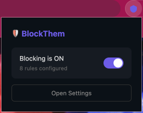
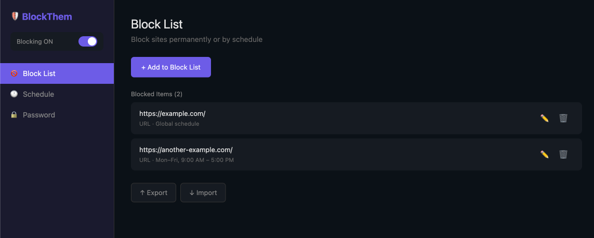
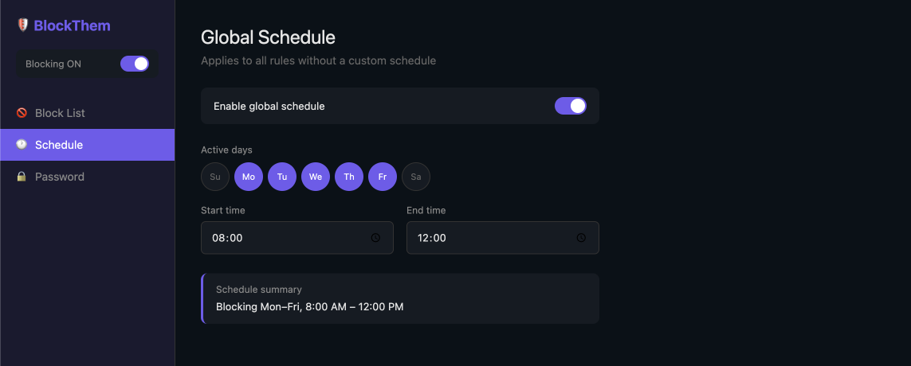
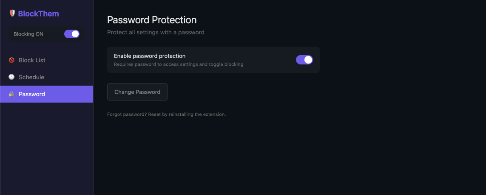

# BlockThem

A Chrome extension that blocks distracting websites with URL and regex rules, flexible scheduling, and optional password protection.



## Features

- **URL and regex blocking** -- block sites by exact URL match or regular expression patterns
- **Flexible scheduling** -- set a global schedule (days of week + time range) or per-rule schedules
- **Password protection** -- lock settings behind a password so you can't easily undo your own rules
- **Import/export** -- back up your rules as JSON and restore them on another browser
- **Quick toggle** -- enable or disable all blocking from the popup with one click

## Screenshots

| Block List | Schedule | Password Protection |
|:---:|:---:|:---:|
|  |  |  |

## Installation

### From source

1. Clone the repository:

   ```bash
   git clone https://github.com/ramiroaraujo/blockthem.git
   cd blockthem
   ```

2. Install dependencies (requires [pnpm](https://pnpm.io/)):

   ```bash
   pnpm install
   ```

3. Build the extension:

   ```bash
   pnpm build
   ```

4. Load in Chrome:
   - Open `chrome://extensions/`
   - Enable **Developer mode** (top-right toggle)
   - Click **Load unpacked**
   - Select the `dist/` directory

### Development

```bash
pnpm dev        # start Vite dev server with hot reload
pnpm test       # run tests
pnpm lint       # check linting
pnpm typecheck  # check types
```

After starting the dev server, load the `dist/` directory in Chrome as described above. Changes will hot-reload automatically.

## Usage

### Adding rules

Open the extension options (click the toolbar icon, then **Open Settings**) and go to **Block List**. Click **+ Add to Block List** and enter either:

- A **URL** pattern (e.g. `https://example.com/`) -- blocks pages whose URL contains this string
- A **Regex** pattern (e.g. `example\.(com|org)`) -- blocks pages whose URL matches the regular expression

### Scheduling

Go to the **Schedule** tab to configure when blocking is active:

- **Global schedule** -- pick active days (Mon--Fri, weekends, etc.) and a time range. Applies to all rules that don't have their own schedule.
- **Per-rule schedule** -- override the global schedule for individual rules when adding or editing them.

### Password protection

Go to the **Password** tab to set a password. Once enabled, the password is required to:

- Access the settings page
- Toggle blocking on or off from the popup

Forgot your password? Reset by reinstalling the extension.

## Tech stack

- [React 19](https://react.dev/) + [TypeScript](https://www.typescriptlang.org/)
- [Vite](https://vite.dev/) + [@crxjs/vite-plugin](https://crxjs.dev/vite-plugin/)
- [Tailwind CSS 4](https://tailwindcss.com/)
- [Zod](https://zod.dev/) for runtime validation
- [Vitest](https://vitest.dev/) for testing
- Chrome Manifest V3, Declarative Net Request API

## License

This project is licensed under the [GNU General Public License v3.0](LICENSE).
